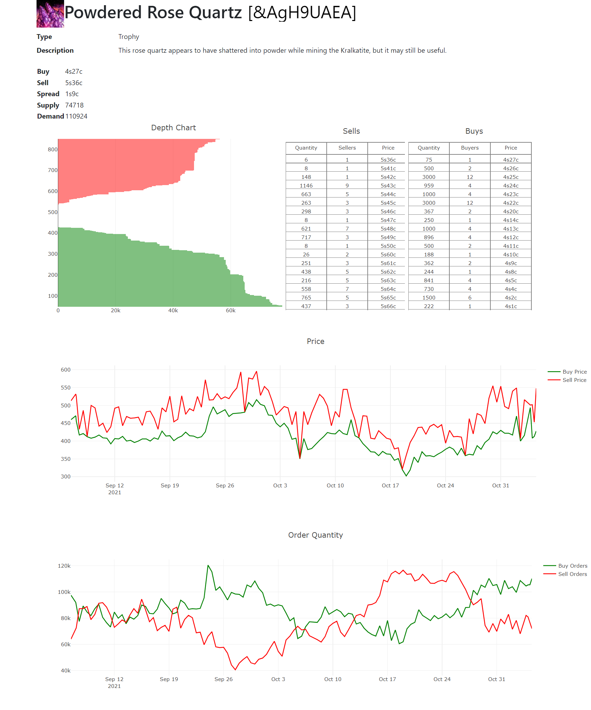

# GW2 BLTC Market Analysis

 

This tool provides at a glace information about items traded on the BLTC, including
- Item Info
    - Icon
    - Name
    - Chat link
    - Type
    - Description
- Market Info
    - Highest buy price
    - Lowest sell price
    - Bid-Ask spread
    - Total supply
    - Total demand
- Listings
    - Graphical representation of 75% of buy and sell quantity
    - Tabular representaion of all listings at their listed unit price

# Version 
- 0.2 New app entry point and webserver
- 0.1 Scraper used as app entry point, program to be run periodically by systemd